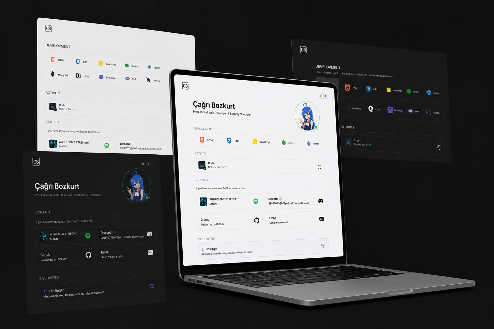
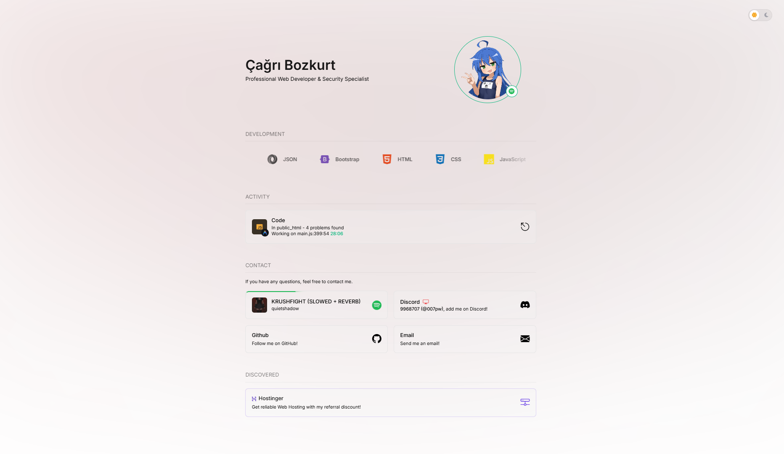
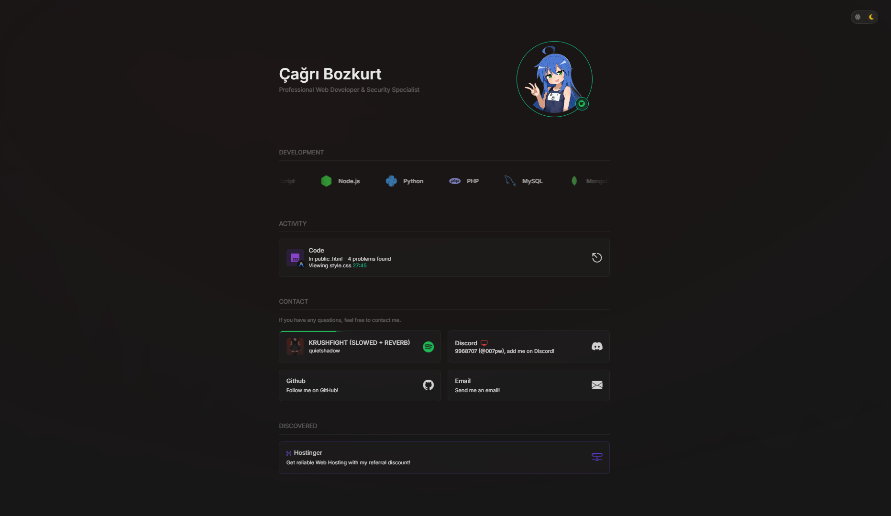

# 🌐 nysscex.pro

A modern, highly customizable, responsive personal portfolio and landing page built with PHP, HTML5, Tailwind-like styling, and Javascript. Fully integrated with Discord Lanyard API for real-time status and Spotify playback synchronization.

[TR (Türkçe) Açıklama için buraya tıklayın](#-nysscexpro-türkçe)

---

## 🚀 Features

- **Centralized Configuration (`config.php`)**: Control and toggle all features, texts, social accounts, and skills from a single file. No need to touch HTML/PHP code.
- **Discord Lanyard Integration**: Real-time retrieval of your Discord status (online, idle, dnd, offline), active badges, display name, and active devices (mobile, desktop, web).
- **Discord Live Avatar Sync**: Dynamically updates your profile avatar with your active Discord avatar using Lanyard API.
- **Live Discord Activity**: Show what game you are playing, coding in VS Code, or doing on Discord with custom scrolling labels for long text.
- **Spotify Playback Tracking & Progress**: Shows your active Spotify track with album art and a CSS border progress animation matching the song's real-time duration.
- **Spotify Ambiance (Dynamic Background)**: Dynamic ambient background glow that matches the dominant color palette of your active Spotify song's album art. Can be turned on/off in configuration.
- **Dynamic Skills Marquee**: Fully responsive, infinite-looping carousel of technologies you use, generated dynamically from the configuration using Devicons.
- **Discover Section / Highlighted Cards**: Section to showcase premium links, referral discounts, or secondary projects with custom branding colors, descriptions, and dynamic hover gradients.
- **Theme Modes (Dark/Light/System)**: Choose between Default Dark, Default Light, or System preference. Enable or disable the toggle switch button in the config.
- **Minimalist Error Pages**: Clean, high-fidelity, colorless 2-column detailed error pages (`404.php`, `403.php`, `500.php`) showing live request details (statusCode, path) inside dynamic JSON blocks, complete with navigation controls.
- **SEO & Social Share Ready**: Complete OpenGraph and Twitter cards meta elements, configurable in `config.php`.

---

## 🛠️ Installation & Setup

1. **Clone the repository** to your web server:
   ```bash
   git clone https://github.com/nysscexdev/nysscex.pro.git
   ```
2. **Rename** the configuration template file:
   Copy `config.example.php` and rename it to `config.php`.
3. **Configure your details** in `config.php`:
   ```php
   return [
       'site_title' => 'Your Name | Developer',
       'discord_user_id' => 'YOUR_DISCORD_ID',
       // Enable/disable features as you wish
       'enable_spotify_status' => true,
       'spotify_ambiance' => true,
       // ...
   ];
   ```
4. **Deploy**: Upload it to any server with PHP 7.4+ and Apache/LiteSpeed (supporting `.htaccess`).

---

## 🤝 Contributions & Future Roadmap

This portfolio is an active, open-source project. New features, sections, and extra sub-pages (e.g. blog, projects page) will be added over time. 

Contributions, bug reports, and pull requests are highly welcome! Feel free to fork the repository, customize it, and submit your PRs.

---

# 🇹🇷 nysscex.pro (Türkçe)

PHP, HTML5, modern CSS ve JavaScript ile geliştirilmiş, Lanyard API ile Discord ve Spotify entegrasyonuna sahip, tamamen dinamik ve responsive kişisel portfolyo sayfası.

## 🚀 Öne Çıkan Özellikler

- **Merkezi Yapılandırma (`config.php`)**: Sitedeki tüm yazıları, sosyal medya adreslerini, Discord ID'nizi ve yeteneklerinizi tek bir dosyadan yönetin. HTML/PHP kodlarına dokunmanıza gerek kalmaz.
- **Discord Lanyard Entegrasyonu**: Discord durumunuzu (çevrimiçi, boşta, rahatsız etmeyin, çevrimdışı), aktif cihazlarınızı (mobil, masaüstü, web) ve rozetlerinizi gerçek zamanlı olarak çeker.
- **Discord Canlı Avatar Senkronizasyonu**: İstendiğinde profil fotoğrafınızı o anki aktif Discord avatarınızla otomatik olarak senkronize eder.
- **Canlı Discord Aktivitesi**: Oynadığınız oyunları, VS Code üzerinde yazdığınız kodları canlı olarak kayan yazılı kartlarda gösterir.
- **Spotify Canlı Şarkı ve İlerleme Durumu**: Dinlediğiniz şarkıyı albüm kapağıyla gösterir ve şarkı süresine göre eş zamanlı hareket eden animasyonlu ilerleme çubuğu barındırır.
- **Spotify Ambiance (Dinamik Arka Plan)**: Spotify'da çalan şarkının albüm kapağındaki ana renge göre sitenin arka plan rengini dinamik olarak değiştirir. İstenirse yapılandırma dosyasından kapatılabilir.
- **Dinamik Teknolojiler (Marquee)**: `config.php` üzerinden belirlediğiniz yetenekleri sonsuz döngü şeklinde kayan bir yazı/ikon şeridi olarak gösterir.
- **Keşfet Bölümü (Kart Paylaşımları)**: Referans kodlarınızı, web sitelerinizi veya diğer projelerinizi kendilerine has renkler, açıklamalar ve hover efektleriyle sergileyebileceğiniz özel alan.
- **Tema Modları (Karanlık/Aydınlık/Sistem)**: Varsayılan temayı aydınlık, karanlık ya da sistem ayarı yapabilir, sağ üstteki gece/gündüz butonunu tamamen gizleyebilir veya aktif bırakabilirsiniz.
- **Minimalist Hata Sayfaları**: Tasarıma tam uyumlu, monokrom (renksiz), 2 sütunlu özel `404.php`, `403.php` ve `500.php` hata sayfaları. Girmeye çalışılan hatalı yol gibi bilgileri dinamik bir JSON kod bloğu içinde gösterir, geri dönme ve sayfayı yenileme butonları barındırır.
- **SEO & Sosyal Paylaşım**: OpenGraph ve Twitter card etiketleri yapılandırma dosyasına bağlı şekilde hazır gelir.

## 🛠️ Kurulum ve Kullanım

1. **Projeyi indirin** veya sunucunuza klonlayın:
   ```bash
   git clone https://github.com/nysscexdev/nysscex.pro.git
   ```
2. **Yapılandırma şablonunu kopyalayın**:
   `config.example.php` dosyasını kopyalayıp adını `config.php` yapın.
3. **Bilgilerinizi düzenleyin**:
   `config.php` dosyasını bir kod editörüyle açıp Discord ID, isim ve sosyal bağlantı bilgilerinizi girin.
4. **Yayınlayın**: PHP 7.4 ve üzeri destekleyen, Apache veya LiteSpeed yüklü herhangi bir sunucuya dosyaları yüklemeniz yeterlidir.

## 🤝 Katkıda Bulunma ve Geliştirme Yol Haritası

Bu proje sürekli olarak geliştirilmektedir. İlerleyen süreçte yeni bölümler, projeler sekmesi ve blog gibi ekstra sayfalar eklenecektir.

Projeyi geliştirmek için yapacağınız geri bildirimler, hata bildirimleri ve Pull Request (PR) katkıları çok değerlidir. Projeyi çatallayarak (fork) dilediğiniz gibi geliştirebilir ve sisteme katkıda bulunabilirsiniz.

---

## 📸 Ekran Görüntüleri / Screenshots

### Genel Önizleme / General Preview (Dark & Light)


### Aydınlık Tema / Light Mode


### Karanlık Tema / Dark Mode


*Demo adresi / Live Demo:* [https://nysscex.pro](https://nysscex.pro)
